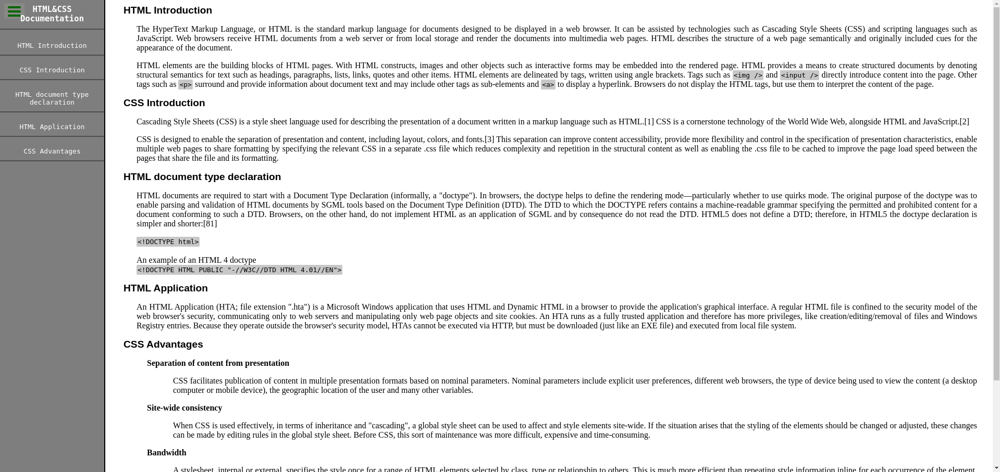

# Amr coding with Jesus - Admission trials

> Amr Coding with Jesus

This project is a Microverse admission trial test

## Built With

- HTML & CSS

## Live Demo

[Portfolio setup & mobile version skeleton!](https://amrhub.github.io/Coding-Amr-Jesus/)

## Getting Started

To get a local copy up and running follow these simple example steps.

### Setup

To setup the webpage in your local up in the repo page:
click on code (dropdown list) > Download as ZIP

### Deployment

To run the project open folder (after extraction) then run index.html

## Authors

👤 **Amr Ahmed**

- GitHub: [@Amrhub](https://github.com/Amrhub/)
- LinkedIn: [Amr Ahmed](https://www.linkedin.com/in/amr-ahmed-655420191/)

## 🤝 Contributing

Contributions, issues, and feature requests are welcome!

Feel free to check the [issues page](../../issues/).

## Show your support

Give a ⭐️ if you like this project!

## Acknowledgments

- Microverse helped/guided me building this project

## 📝 License

This project is [MIT](./MIT.md) licensed.
